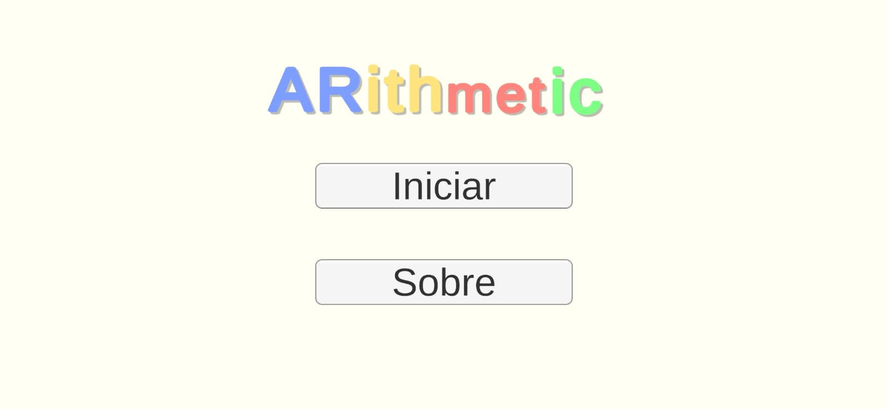
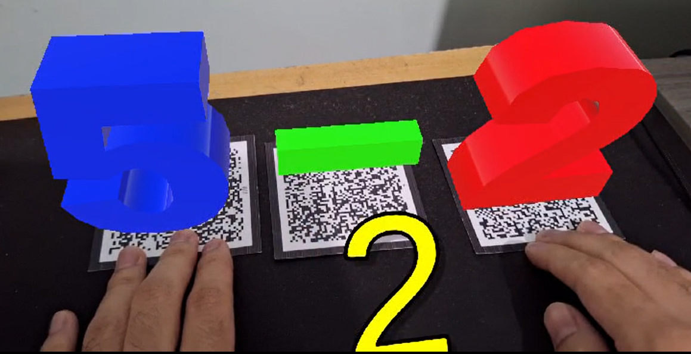

# ARithmetic

Sistema para reconhecimento e execução de operações matemáticas básicas (adição, subtração, multiplicação e divisão) em um ambiente tridimensional interativo.

O aplicativo identifica os números e o operador desejado através de marcadores (targets). Uma vez feita a identificação, o sistema exibe a informação relacionada ao marcador sobrepondo elementos virtuais à visão do usuário. O sistema faz os cálculos e apresenta o resultado de forma interativa e visual.


## Imagens do sistema

|  |  |
|---|---|
|  |  |


## Instalação do APK

Para fazer a instalação é necessário permitir a instalação de aplicativos de fontes desconhecidas. 

- Acesse as configurações do seu dispositivo.
- Vá até "Aplicativos".
- Selecione "Acesso especial" e depois "Instalar apps desconhecidos".

Em seguida baixe o aplicativo para Android pelo link: 
- [Baixar ARithmetic](https://drive.google.com/file/d/1GD85mIvEYOTn6JuRi2On-eiutjjCOT2R/view?usp=drive_link)

## Rodando localmente

1. **Clone o repositório**

    ```bash
    git clone https://github.com/R2Damacena/operacoes-matematicas-basicas-em-realidade-aumentada.git
    ```

    >Caso prefira, você poder baixar o repositório como ZIP e extrair a pasta do projeto.

2. **Abra a pasta do projeto no Unity**

3. **Configure o Vuforia**
    - Tutorial para baixar e configurar o Vuforia em um projeto Unity: [Tutorial Vuforia](https://www.youtube.com/watch?v=RMOMTyfECTk)

4. **Configure os marcadores**
    - Marcadores disponíveis em PDF no arquivo [targets.pdf](targets.pdf).
    - Tutorial para configurar os marcadores no Vuforia: [Tutorial marcadores](https://www.youtube.com/watch?v=-bF0oxgtt6A)

## Autores
| [<br><sub>Arthur Damacena Silva</sub>](https://github.com/R2Damacena) |  [<br><sub>Guilherme Alves Rabelo</sub>](https://github.com/ItsGui8) |  
| :---: | :---: | 
